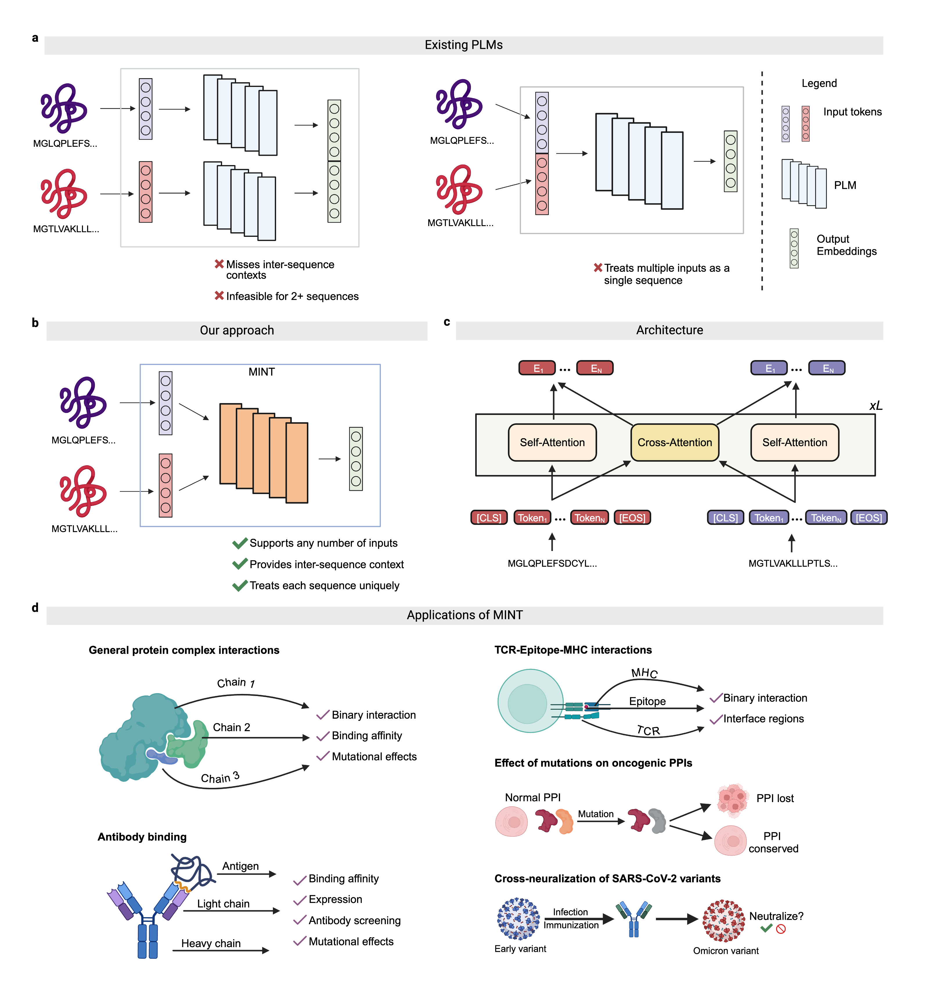

<h1 align="center">
  Learning the language of protein-protein interactions with PLM-Multimer
</h1>

## 🧬 Overview of PLM-Multimer

PLM-Multimer is a Protein Language Model (PLM) specifically designed to model sets of interacting proteins in a contextual and scalable manner. Using unsupervised training on a large curated PPI dataset derived from the STRING database, PLM-Multimer significantly outperforms existing PLMs in six diverse tasks, including binding affinity prediction and estimation of mutational effects. Beyond these core capabilities, it excels at modeling complex protein assemblies and surpasses specialized models in antibody-antigen modeling and T cell receptor–epitope binding prediction. PLM-Multimer's predictions of mutational impacts on oncogenic PPIs align with experimental studies and provide reliable estimates for the potential for cross-neutralization of antibodies against SARS-CoV-2 variants of concern. These findings position PLM-Multimer as a powerful tool for elucidating complex protein interactions, with significant implications for biomedical research and therapeutic discovery.



## 🖥️ Installation 

1. Create a new [conda](https://docs.anaconda.com/miniconda/install/) environment from the provided `enviroment.yml` file. 

```
conda env create --name multimer --file=environment.yml
```

2. Activate the enviroment and install the package from source.

```
conda activate multimer
pip install -e .
```

3. Check if you are able to import the package.

```
python -c "import plm_multimer; print('Success')" 
```

4. Download the model checkpoint from [here]() and note where the path where it is stored. 

## 🚀 How to use 

### Generating embeddings

We suggest generating embeddings from a CSV file containing the interacting sequences like this one [here](./data/protein_sequences.csv). Next, simply execute the following code to get embeddings. 

```
import torch
from plm_multimer.helpers.extract import load_config, CSVDataset, CollateFn, PLMMultimerWrapper

cfg = load_config("data/esm2_t33_650M_UR50D.json") # model config
device = 'cuda:0' # GPU device
checkpoint_path = '' # Where you stored the model checkpoint

dataset = CSVDataset('data/protein_sequences.csv', 'Protein_Sequence_1', 'Protein_Sequence_2')
loader = torch.utils.data.DataLoader(dataset, batch_size=2, collate_fn=CollateFn(512), shuffle=False) 

wrapper = PLMMultimerWrapper(cfg, checkpoint_path, device=device)

chains, chain_ids = next(iter(loader)) # Get the first batch
chains = chains.to(device)
chain_ids = chain_ids.to(device)
embeddings = wrapper(chains, chain_ids)  # Generate embeddings
print(embeddings) # Should be of shape (2, 1280)
```

### Finetuning 

To finetune our model on a new supervised dataset, simply set the `freeze_percent` parameter to anything other than 1. Setting it to 0.5 means the 50% of the model layers can be trained. For example, 

```
import torch
from plm_multimer.helpers.extract import PLMMultimerWrapper

cfg = load_config("data/esm2_t33_650M_UR50D.json") # model config
device = 'cuda:0' # GPU device
checkpoint_path = '' # Where you stored the model checkpoint

wrapper = PLMMultimerWrapper(cfg, checkpoint_path, freeze_percent=0.5, device=device)
for name, param in wrapper.model.named_parameters():
    print(f"Parameter: {name}, Trainable: {param.requires_grad}")
```

### Examples 

We provide several examples highlighting the use cases of PLM-Multimer on various supervised tasks and different protein types in the `downstream` folder. 

1. [Predict whether two proteins interact or not](./downstream/GeneralPPI/ppi)
2. [Predict the binding affinity of protein complexes](./downstream/GeneralPPI/pdb-bind)
3. [Predict the difference in binding affinity in protein complexes upon mutation](./downstream/GeneralPPI/SKEMPI_v2)
4. [Predict whether two proteins interact or not after mutation](./downstream/GeneralPPI/mutational-ppi)


## 📝 Citing 

Coming soon!